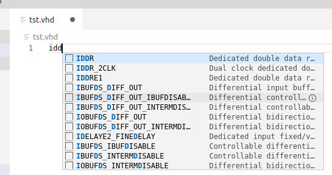
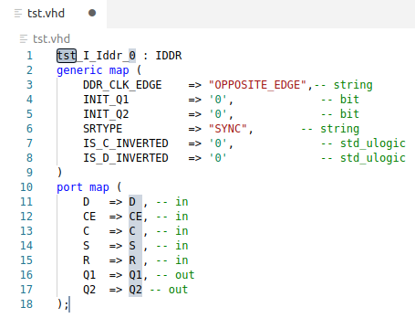

# Xilinx-Snippets Extension

This package provides the Xilinx FPGA Unisim library as a set of **VHDL** snippets.

Xilinx FPGA Unsim libraries are or can be used to instantiate hardware dedicated logic elements 
available in the different FPGA families, elements such as PLL, MMCM , LUT, ...

**Remark:** A similar package for Atom can be found [here](https://github.com/ZirconfleX/Xilinx-Snippets-Vhdl-Atom)

### Supported  FPGA families

   - Spartan-6
   - All of the 7-Series
- All of Ultrascale and Ultrascale+ devices.
- Primitives of other FPGA families will be add as they are used in my designs.

The list **is not** a complete copy of the Unisim library available in the Xilinx Vivado tool!
It does not contain elements as PCIE, Ethernet MAC, transceivers or other because those elements are too big to instantiate and one will probably never instantiate these anyway because all of these components are typically used through a wizard. The wizard provides an instantiate-able model targeted and customised following what the user demanded through the wizard.

* ### Use of the snippet list

    - The snippets only work when a document is set in VHDL mode.

        - In the bottom right cornet or the main VCcode window click the default [Plain Text] language more and change it into [vhdl]. 
            Click [Plain Text] and select from the appearing fall down list [vhdl].

            or

        - After starting an new document save it immediately with the extension .vhd.

    - Start typing the first letters of the components that needs to be instantiated and select the primitive from the presented list. Assume a IDDR (Input Dual Date Rate) register needs to be instantiated. Start typing 'idd...' or 'IDD...'. Select ( click the square) the IDDR primitive from the presented list as shown in the figure below.
        

    - When the IDDR is instantiated it appears as in below figure
        

        - Component labels are build this way:
            	```<File_Name_without_extension>_I_<Name_of_Primitive>_<number>```
        - The instantiated component label starts with the name of the file it is instantiated in. 
            In this example the file name is *tst.vhd*, the components name starts thus with *tst*. 
            This is done to easily find components in hierarchical designs. 
            As showed the cursor is dropped on the highlighted *tst* to allow one to change it easily. 
            f the name can be kept, just hit **[Tab]**.
        - The cursor jumps now to the second highlighted area, being *0*.
            The is providing the amount of times the primitive is instantiated.
            Change it by typing a number or something else or leave it by hitting **[Tab]**
        - Hitting **[Tab]** makes the cursor jump from one port element to another allowing one to change the name of the connected signal or bus. After a signal or bus name is provided, hit [Tab] to jump to the next port.
        - Adjust the attributes of used primitives as corrections to normal code.

## Known Issues

- None

## Release Notes

**0.0.1** : Initial release


